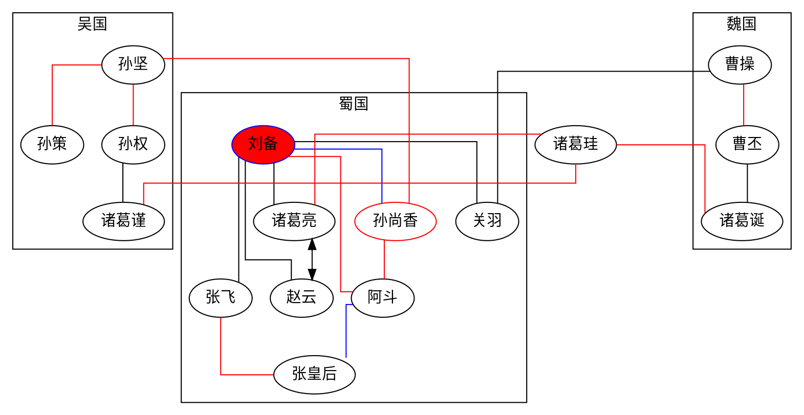
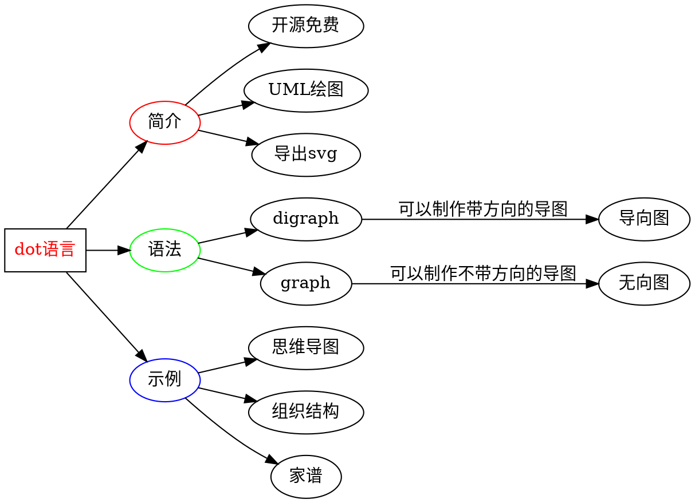
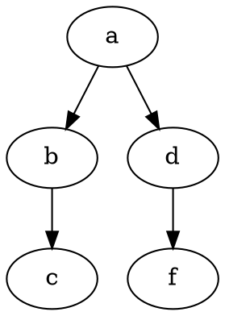

# Graphviz

图形描述语

## 关键字

* `strict` 严格的图限定，禁止创建多个相同的边
* `graph` 无向图
* `digraph` 有向图
* `node` 节点
* `edge` 边
* `subgraph` 子图

## 节点 node

[shape 官网](https://graphviz.gitlab.io/_pages/doc/info/shapes.html)

* `shape` 形状
  * `ellipse` 椭圆
  * `box` 矩形
  * `circle` 圆
  * `point` 点
  * `square` 正方
  * `egg` 卵
  * `triangle` 三角
  * `house` 房子
  * `plaintext` 文字
  * `plain` 下划线文字
  * `diamond` 菱形
  * `trapezium` 梯形

## 布局方向 rankdir

* `TB` 从上到下
* `LR` 从左到右
* `BT` 从下到上
* `RL` 从右到左

## 方向

| 方向 | 说明 |
|-|-|
|n|north 北|
|ne|north east 东北|
|e|east 东|
|se|south east 东南|
|s|south 南|
|sw|south west 西南|
|w|west 西|
|nw|north west 西北|
|c|center 中部|
|_|任意|

## 线条式样 splines

* `none` 无边
* `true` 或 `spline` 无规则，可为直或者曲线
* `false` 或 `line` 直线
* `polyline` 折线
* `curved` 曲弧线
* `ortho` 正直线

## 箭头式样 dir

* `both` 双向
* `forward` 前
* `back` 后
* `none` 无

## 关系图

## 例子

