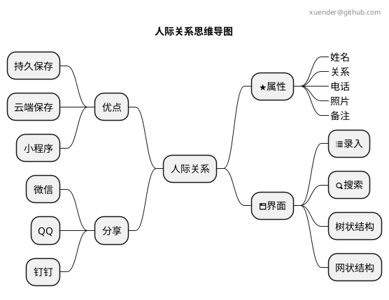
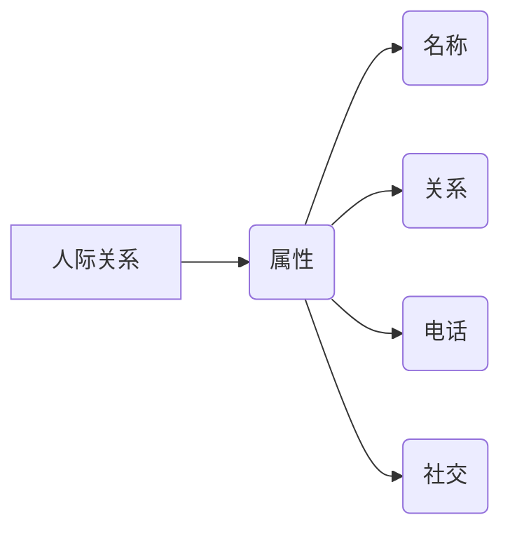

# 思维导图

## 使用Markdown编辑思维导图

### plantuml

```puml
@startmindmap
title 人际关系思维导图
* 人际关系
** <&star>属性
***_ 姓名
***_ 关系
***_ 电话
***_ 照片
***_ 备注
** <&browser>界面
*** <&list>录入
*** <&magnifying-glass>搜索
*** 树状结构
*** 网状结构

left side

** 优点
*** 持久保存
*** 云端保存
*** 小程序
** 分享
*** 微信
*** QQ
*** 钉钉
header
  xuender@github.com
endheader
@endmindmap
```

### mermaid

```mermaid
graph LR
a[人际关系] --> b(属性)
b --> c(名称)
b --> d(关系)
b --> e(电话)
b --> f(社交)
```
