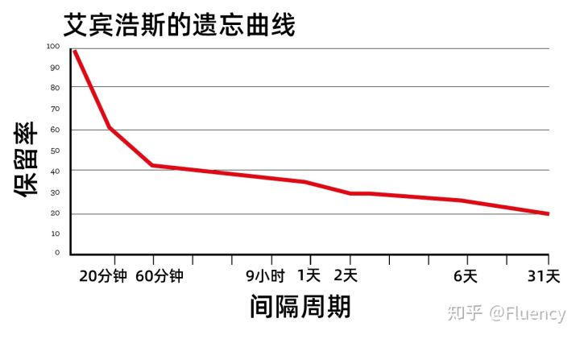
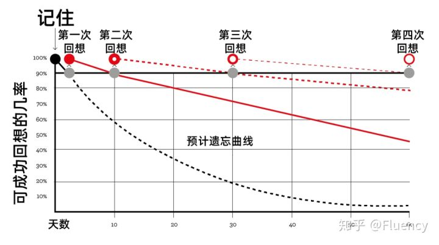

# 间隔效应

“间隔效应”（spacing effect）能一定程度上改善记忆中大量的遗忘。原计划用30分钟一口气背完的内容，安排到三天中各花10分钟回忆巩固，一个月后进行测试记忆的效果会提升10%。

反之，如果复习间隔过短（太密集的缘故），在间隔效应（spacing effect）的作用下，记忆效果会大幅度减退。

## 详情

尝试将学习知识的过程分布在多个分散的时间区间里，我们反而能够更好地回想起这些知识。

> 间隔重复非常有效。
> 在4个月的时间里，每天练习30分钟，你可以学习3600张抽认卡，准确率达到90%到95%。
> 这些卡片可以帮助你学习字母表、词汇、语法甚至发音。
> 而且它们没有那么单调乏味，因为通过抽认卡的形式来学习知识是一项具有足够的挑战性的活动，它能保持使用者感受到乐趣。

我们需要停止死记硬背式地学习，专注于真正有效的方法——间隔重复

* 日程安排
  传统典型的间隔重复系统会在每隔一小时、一天、隔天、每周、每两周、每月、每六个月、每年提示用户检查信息。能正确通过测试，信息就会进入下一个复习间隔，同时复习的次数也会减少；如果未通过测试，它就会移动回间隔时间短的复习间隔上，并且增加复习量。
* 信息的存储和组织
  抽认卡或间隔重复软件(如Anki和SuperMemo)是最常见的选择。软件有一个明显的优点，即不需要太多的维护工作，并且有一个内置的重复计划。坊间证据表明，将信息写在抽认卡上有助于学习过程。
* 用于跟踪进度的度量
  间隔重复系统如果包含有正向反馈效果会更好。这就是为什么像Duolingo和Memrise这样的学习软件包含了积分系统、日常目标、排行榜等等。可追踪的进度给我们一种进步和改进的感觉。
* 设定复习时间
  如果我们练习的时间太长，我们的注意力就会减弱，我们保留的信息量就会减少。同样地，一次复习也需要足够长的时间来确保能集中注意力。建议是不超过30分钟，在进行其它复习之前都需要休息一下。

遗忘曲线

间隔效应

